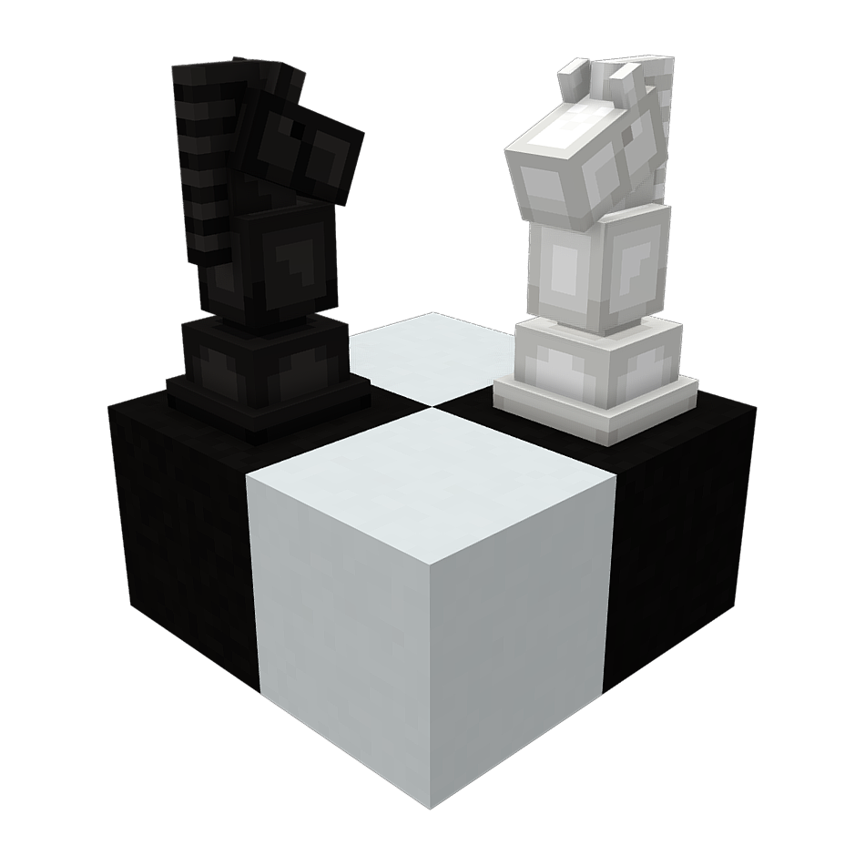

# ChessCraft
  

ChessCraft is a Paper plugin that adds in-world chess matches against other players and chess engines.
With ChessCraft, players can challenge each other to intense chess battles in a Minecraft environment.

## Features

- In-world chess matches, reminiscent of life-size chess boards.
- Pieces: Supports both custom models through a resource pack (linked below), and using textured player heads for resource pack free use.
- Automatic downloading of the correct Stockfish (chess engine powering ChessCraft) executable for your platform.
- Stores history of paused/incomplete and completed matches
- Export matches in PGN format for external analysis
- Elo rating system for PvP matches with server leaderboard

## Download

Downloads can be obtained from the [releases](https://github.com/jpenilla/chesscraft/releases) section.

Development builds

> Development builds are available at https://jenkins.jpenilla.xyz/job/ChessCraft

## Installation

To install ChessCraft, simply drop the plugin into your Paper server's `plugins` folder.
The configuration can be adjusted at `plugins/ChessCraft/config.yml`.

By default, ChessCraft will be configured for use with a resource pack containing custom models for chess pieces.
It can be downloaded [here](https://github.com/jpenilla/chesscraft/raw/master/resources/ChessCraft_Resource_Pack.zip). You can either have your players manually install it, or set it as your server resource pack/merge its contents into your existing server resource pack.

## Usage

First, you must create a chessboard by standing at the desired location for the southwest corner of the board and using the `/chess create_board <board_name> <facing>` command.

Then, use the `/chess challenge player|cpu` commands to challenge an opponent. That's all! Now you can right-click the pieces to start making moves!

Chess boards will not automatically place or remove blocks from the world (besides the pieces if configured to use block pieces), they will only manage pieces. This is to allow
building your chess board in any way you like. However, the `/chess set_checkerboard` command can be used to automatically place blocks for a standard board.

## Contact

For questions and support prefer asking in the Discord linked above before opening an issue.
The [issue tracker](https://github.com/jpenilla/chesscraft/issues) is intended for tracking bugs, feature requests, and etc., not support requests.
